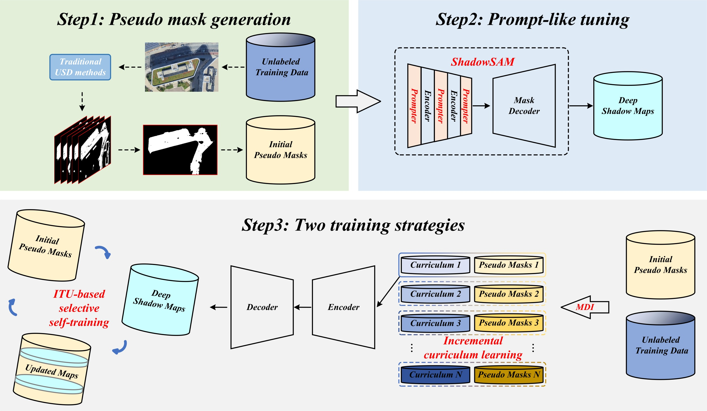
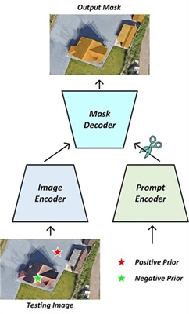
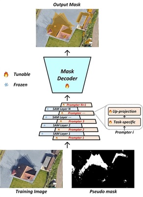
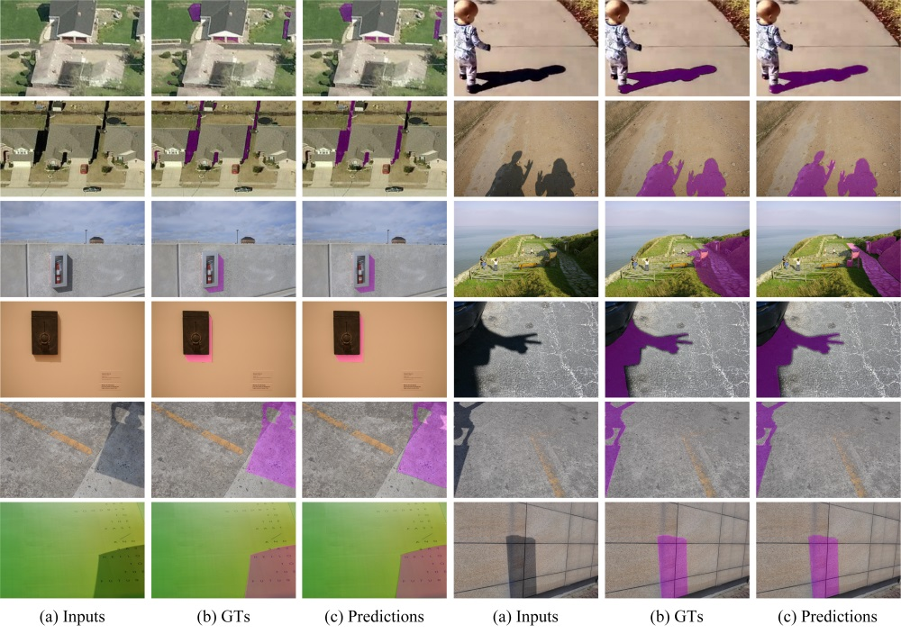
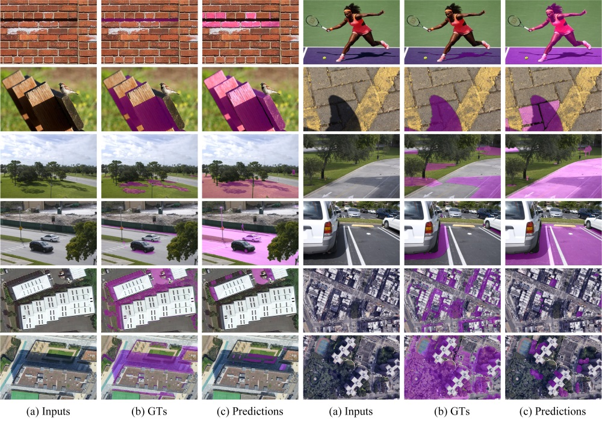
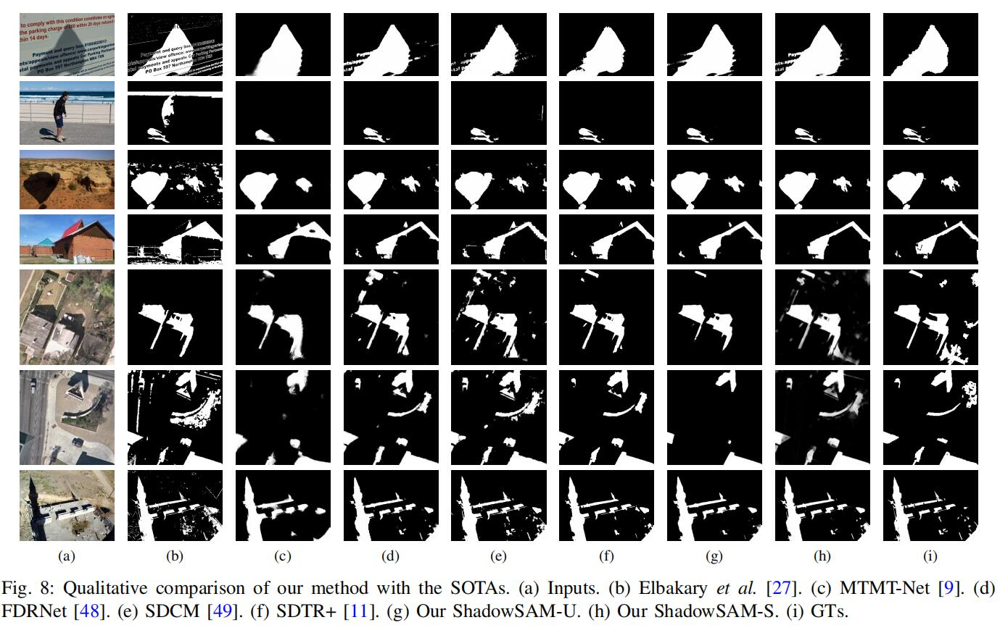

# Make Segment Anything Model Perfect on Shadow Detection
by Xiao-Diao Chen, Wen Wu, Wenya Yang, Hongshuai Qin, Xiantao Wu, and Xiaoyang Mao

#### News: In 2023.7.6, We release the unsorted code for other researchers. The sorted code will be released after.

***

## SAM and ShadowSAM
### SAM's architecture

### ShadowSAM's architecture

### Bottom-N strategy
#### Good cases

#### Bad cases

## Shadow detection results at test datasets
The results of shadow detection on three datasets (SBU, UCF, ISTD) can be found at [BaiduNetdisk](https://pan.baidu.com/s/1v3yflIR3kn6QyC1OLzl_eQ)(8myd), while the pretrained model can be downloaded at [BaiduNetdisk](https://pan.baidu.com/s/1AC60G2H0ctYegHhzxDsWLQ?pwd=9y41)(9y41).

## Visual comparison with SOTA

## Requirement
* Python 3.6
* PyTorch 1.10
* torchvision
* timm 0.3.2
* numpy
* tqdm
* PIL
* pydensecrf ([here](https://github.com/Andrew-Qibin/dss_crf) to install)

## Useful links
UCF dataset: [BaiduNetdisk](https://pan.baidu.com/s/1xijuxXullcGNkMkFK_reUQ)(fovr)

SBU dataset: [BaiduNetdisk](https://pan.baidu.com/s/19-k2aZUXnQOlwkcgROb3hA)(o4it)

ISTD dataset: [BaiduNetdisk](https://pan.baidu.com/s/1AwjUwTVRZJSWTYiSGUpJAw)(ni0z)

